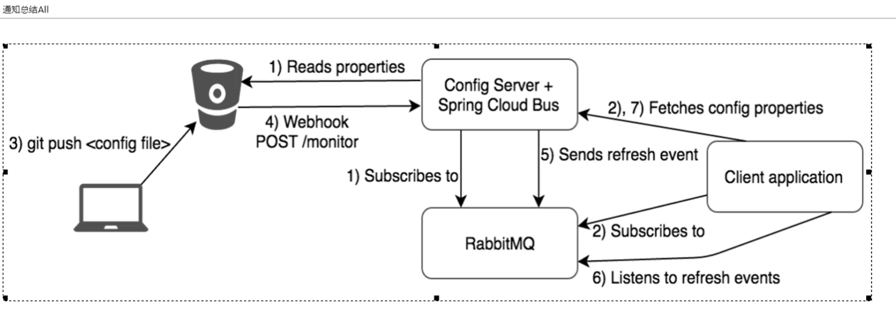

#spring cloud config client
## pom Config
     <dependency>
          <groupId>org.springframework.cloud</groupId>
          <artifactId>spring-cloud-starter-config</artifactId>
      </dependency>
## application.yml
    spring:
      application:
        name: cloud-config-client
      cloud:
        config:
          lable: master #分支名称
          name: config #配置文件名
          profile: master #文件后缀
          uri: http://localhost:3344 #配置中心地址
      rabbitmq: #配置spring cloud bus
        host: 39.105.136.137
        port: 5672
        username: guest
        password: guest
    #rabbitmq相关配置，暴露bus刷新配置的端点
    management:
      endpoints:
        web:
          exposure:
            include: "*"
## pom Bus
     <dependency>
         <groupId>org.springframework.cloud</groupId>
         <artifactId>spring-cloud-starter-bus-amqp</artifactId>
     </dependency>
## 业务类
    @RefreshScope
    
